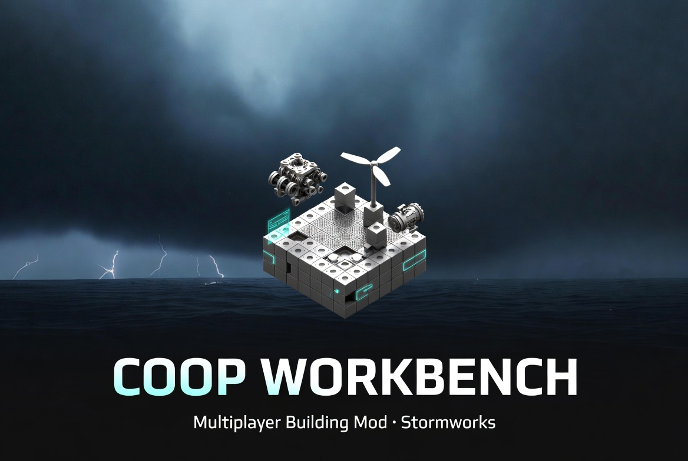

<!-- Banner -->


# Coop Workbench

**Real-time multiplayer building for [Stormworks](https://store.steampowered.com/app/573090/).**
Place, delete, or paint a block on one machine and it appears **live** on your partner's — synced
peer-to-peer over Steam. No server, no port-forwarding, no IP addresses.


> ⚠️ **Early and experimental.** This is a hobby mod, tested in a narrow set of conditions (see
> [Tested / not tested](#tested--not-tested)). It runs entirely **in-memory on your own game and
> modifies no game files** — but back up your creations and use it at your own risk.

## Why this exists

Co-op in Stormworks never really felt like *co-op* to me. You spend **hours** building your own
separate thing, then meet up and go *"hey, look at what I made."* But the game is **more than half
building** — and that half, the best half, you do alone.

Coop Workbench is the missing piece: **actually build the same vehicle together, at the same time.**
Think Google Docs or Figma, but for Stormworks vehicles — you place a block, your friend sees it
appear instantly, and you build as a team instead of in parallel.

> 👋 Heads up: this is my **first mod** and my **first public repository**. I'm learning as I go, so
> feedback, corrections, and help are genuinely welcome — see [Contributing](#contributing).

## Hasn't someone already made this?

No — and that's the surprising part. Real-time co-op building has been one of Stormworks' **most-requested
features since within months of its 2018 launch.** The developers' feedback site has a long-running
[*Coop Build Mode* request](https://geometa.co.uk/support/stormworks/2620) with dozens of votes and
**~69 separate duplicate requests merged into it**, and players were still filing new ones in 2026. As
one put it, they'd been *"waiting for years."*

It hasn't happened because it's genuinely hard, and the developers have
[said since 2018](https://steamcommunity.com/app/573090/discussions/0/3397295779078820665/) they'd
*"like to do this eventually"* but have no near-term plans. Two reasons it's tough:

- **The editor is single-player by design.** Stormworks multiplayer syncs *spawned* vehicles, not the
  workbench — normally the only way to share a build is to spawn it and have your friend load a copy.
- **There's no modding API for the build menu.** Stormworks' Lua APIs cover missions and in-vehicle
  logic, never the editor — so nobody could build this as a conventional mod.

Coop Workbench takes the one door that's open: it runs as an **in-memory mod** that drives the game's
own editor. It's an experiment, not a finished product — but it's a real, working attempt at the thing
the community has wanted for years.

## What works today

| Feature | Details |
|---|---|
| 🧱 **Placement** | single-click, click-**drag**, and big **area fills** — with type, position, rotation, and color |
| 🩹 **Delete** | eraser tool, including fast **drag-erase**, with instant same-frame remesh |
| 🎨 **Paint** | whole-block **and per-face** repaints |
| 🔺 **Angled parts** | wedges, pyramids, inverse pyramids, etc. keep their correct auto-filled shape |
| ⚡ **Connections** | **electric and on/off-logic wires** sync — add *and* disconnect — between the same two nodes |
| 🎥 **Partner overlay** | see your partner's **camera** as a marker floating in the workbench, so you know where they're working |
| 🤝 **Zero-setup networking** | peer-to-peer by SteamID over Steam's relay — no server, no ports, no IPs; you don't even need to be in the same Stormworks session |
| 🔄 **Auto-arm** | your first edit each session arms the sync automatically — no extra step |
| 🛡️ **Patch-resilient** | every hooked function is found by a signature scan at startup, so game updates are less likely to break it |

## Tested / not tested

Being honest about coverage matters more than hype, so:

**✅ Tested and working** (on two real machines over Steam):
- **Custom gamemode**, at the **starter vehicle workbench**, with **both players starting from an
  empty craft and placing their first block at the same origin spot.**
- The full feature table above held up in a live two-machine session.

**❓ Not yet verified — help wanted:**
- **Other workbenches** (larger benches, career/survival benches) — untested.
- **World seeds / workbench position in the world.** The sync uses **body-relative voxel
  coordinates**, which *should* be independent of the world seed and where the bench sits — but this
  is **unconfirmed**, and we don't yet know how different benches set the craft origin. If your blocks
  land in the wrong place, this is the likely reason.

If you try it somewhere new, [**opening an issue**](../../issues) with your result — and, if something
broke, **both players' `coopworkbench-log.txt`** (with SteamIDs removed) — is the single most useful
thing you can contribute right now.

## Known limitations — what doesn't work yet

It's **alpha**. Plenty is still missing or in progress:

- **No late-join / full-craft sync.** Only edits made **after** the mod loads sync; blocks that already
  existed won't sync until you touch them. Both players should start from the same base.
- **Not all wire types synced.** Electric *and* on/off-logic wires sync (including **disconnects**);
  other connection types (number, composite, video, audio, fluid) are untested, and rope is separate.
- **No component-property sync** — battery charge %/name, logic-constant values, and other per-part
  settings don't carry across.
- **No microcontroller-resize sync**, and a microcontroller's internal logic isn't synced.
- **No undo/redo, symmetry-mode, or multi-body sync**, and it's **two players** only for now.
- **Concurrent edits to the same voxel** resolve last-writer-wins — there's no smart merge yet.
- **Missing parts are skipped.** If your partner places a modded part you don't have installed, it's
  logged and skipped, not placed.
- **Windows only**, and a **game update can break it** until offsets are re-checked (a signature scan
  at startup makes that less likely).

All of this is on the [roadmap](ROADMAP.md) — help is very welcome.

## Quick start

1. Both players: install Steam + Stormworks, launch the game, and open the **vehicle workbench**.
2. **Start from the same base:** easiest is both start with an empty craft and each place **one block
   at the same spot** (e.g. the origin) so coordinates line up.
3. Grab the [latest release](../../releases), unzip it, and both run **`inject-both.bat`**. It prints
   *your* SteamID64 and asks for your *partner's* — paste it in.
4. Start building. Your first edit auto-arms the sync; you'll see each other's edits live.

Full step-by-step + a feature-by-feature checklist:
[`coop-package/README.txt`](sw-coop-build/coop-package/README.txt) and
[`coop-package/TESTING.txt`](sw-coop-build/coop-package/TESTING.txt).

> Windows Defender or your antivirus may warn about the injector — it uses `LoadLibrary` to load the
> mod DLLs into the running game. The source for everything it loads is in this repo.

## Build from source

Requires the **MSVC x64 build tools** (VS2022 Build Tools) with `ml64` (MASM). From `sw-coop-build/`:

```bat
build-coop.cmd
```

Then load it into the running game with `inject.ps1`. During development, `reload-build.ps1` unloads
the live mod and rebuilds so you can re-load without restarting the game. Architecture and hook map:
[`ARCHITECTURE.md`](ARCHITECTURE.md).

## How it works (one line)

Rather than writing the voxel grid directly (which never triggers a render), the mod **hooks the
game's own place / delete / paint / connect commands and calls them**, so every synced action runs
through the game's real code path and looks identical to a manual click. More in
[`ARCHITECTURE.md`](ARCHITECTURE.md).

## Roadmap — the north star

The goal isn't just "syncs blocks" — it's the **best co-op building experience in Stormworks**:

- **Never silently desync** — a periodic hash detects drift, and a full-craft snapshot can heal any
  divergence (also enabling **late-join**).
- **Full edit coverage** — all connection types, component properties, undo/redo, symmetry,
  multi-body, and more than two players.
- **Presence & polish** — live partner cursors in each player's color, incoming-edit highlights, and
  a sync-status HUD on the in-world overlay.

**Concrete, prioritized tasks — from no-code test reports to bigger features — live in
[`ROADMAP.md`](ROADMAP.md).** That's the best place to see where to jump in.

## Contributing

Contributions are very welcome — this is exactly the kind of project the Stormworks community can
push forward together. Bug reports (especially "I tested it in *X* and it did *Y*"), feature ideas,
and pull requests all help. Start with [`CONTRIBUTING.md`](CONTRIBUTING.md).

## Disclaimer

Coop Workbench is an **unofficial, fan-made mod**. It is **not affiliated with, endorsed by, or
supported by** the developers or publisher of Stormworks. It runs entirely in your own game's memory,
**modifies no game files, and ships no game assets**. It's provided as-is, with no warranty — see
[Tested / not tested](#tested--not-tested). Back up your creations.

## License

[MIT](LICENSE) © 2026 BayneBuild
